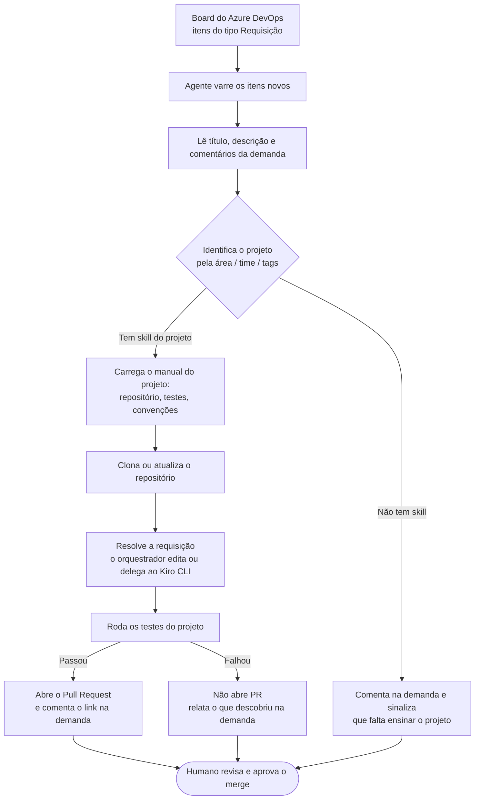
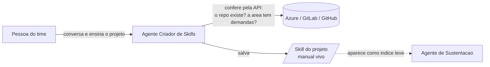
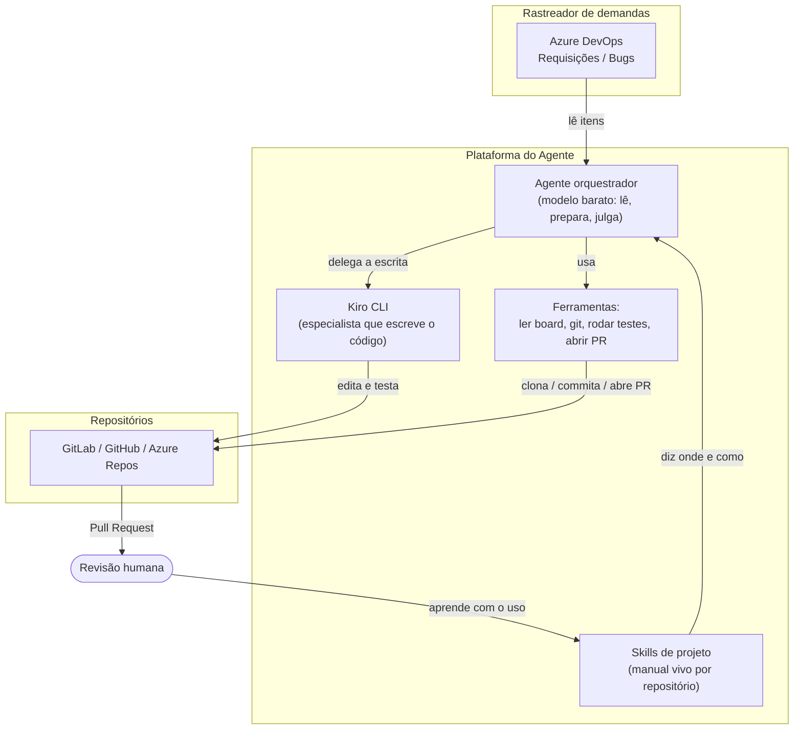

# Agente de Sustentação Autônoma — da demanda ao Pull Request

## Resumo executivo

Temos hoje uma fila grande de itens de sustentação. Boa parte são **requisições** —
pedidos simples e repetitivos que os clientes fazem (por exemplo, um cadastro em
massa). Eles consomem o tempo de desenvolvedores que poderiam estar em problemas mais
complexos.

A proposta é um **agente que lê o board do Azure, entende a requisição, encontra o
repositório certo, resolve e abre o Pull Request** — deixando tudo pronto para a
aprovação de uma pessoa. O agente **nunca faz merge**: ele para exatamente no ponto em
que um humano revisa e decide. O objetivo não é tirar a pessoa do processo, é tirar da
pessoa o trabalho mecânico e entregar o item **pronto para avaliar**.

Para o agente saber *em qual repositório trabalhar* e *como resolver cada tipo de
problema*, ele aprende isso **conversando com o time** — um segundo agente, o *Criador
de Skills*, transforma esse conhecimento em um "manual vivo" por projeto. Essa parte
está em construção.

---

## 1. O problema

- A fila de sustentação cresce mais rápido do que o time consegue absorver.
- Muitos itens são **requisições simples**: baixo risco, alto volume, muito repetitivo.
- Cada requisição exige o mesmo caminho manual: achar o repositório, entender o pedido,
  fazer a mudança, rodar os testes, abrir o PR, comentar na demanda.
- Esse caminho é justamente o que uma máquina faz bem — e é o que rouba tempo de quem
  deveria estar no que exige julgamento humano.

## 2. A ideia em uma frase

> Um agente varre o board, pega as requisições de um tipo, resolve as que consegue e
> entrega **Pull Requests prontos para revisão** — com os testes rodados e um resumo do
> que foi feito.

O que muda para o time: em vez de *fazer* dezenas de requisições, o time passa a
**revisar e aprovar** dezenas de requisições. Um trabalho muito mais rápido e menos
cansativo.

---

## 3. O fluxo completo

Passo a passo, em linguagem simples:

1. **Varre o board.** O agente consulta o Azure e pega os itens de um tipo e estado —
   por exemplo, *Requisição* / *Novo*.
2. **Entende o pedido.** Lê o título, a descrição e os comentários. Se o pedido não tem
   informação suficiente para agir, ele **não inventa**: comenta na demanda pedindo o
   que falta e passa para o próximo. Uma boa pergunta vale mais que um PR errado.
3. **Descobre o projeto.** A própria demanda já traz a pista (time, área, tags). Com
   isso o agente encontra o **manual do projeto** (a "skill de projeto") e passa a saber
   o repositório, como rodar os testes e as convenções de branch.
4. **Prepara o ambiente.** Clona o repositório (ou atualiza, se já estiver na máquina) e
   cria um branch de trabalho.
5. **Resolve.** Para ajustes pequenos, o próprio orquestrador edita. Para mudanças que
   exigem explorar o código, ele **delega a escrita ao Kiro CLI**, um agente
   especialista de código que roda na mesma máquina, dentro do repositório.
6. **Prova.** Roda os testes/lint/build do projeto. **Se o teste falhar, não abre PR** —
   relata o que encontrou. Se não houver teste no ambiente, ele diz isso claramente no
   PR, para o revisor saber o que não foi verificado.
7. **Entrega para revisão.** Abre o Pull Request com uma descrição do que estava errado,
   o que mudou, como verificou e o link da demanda; e comenta o link do PR na própria
   demanda.
8. **Humano decide.** A pessoa revisa e faz (ou não) o merge. **Esse passo é sempre
   humano.**

### Por que o resultado é sempre um PR (e não o merge)

O PR é o ponto natural de controle: é onde já existe revisão, histórico e política de
aprovação. O agente para ali de propósito. Isso vale para requisições de código; para
pedidos que não terminam em código (uma configuração, um dado), a mesma lógica se
aplica — o agente deixa **a proposta pronta** e um humano confirma.

---

## 4. A peça que torna isso possível: o conhecimento dos projetos

Um agente, sozinho, **não sabe** em qual repositório mora a demanda da "equipe X", nem
como se rodam os testes lá, nem como aquele tipo de problema costuma ser resolvido. Esse
conhecimento está na cabeça das pessoas.

Em vez de programar isso projeto a projeto (caro, engessado, desatualiza rápido), a
ideia é **ensinar o agente conversando** — e guardar o que ele aprendeu como um
**manual vivo por projeto**. Essa é a função do **Criador de Skills**.

Como funciona, na prática:

- A pessoa **conversa** com o Criador de Skills: "quando eu peço da equipe *Área do Time*,
  o projeto é o repositório `grupo/projeto-backend`; os testes rodam com tal comando; um
  pedido de cadastro em massa geralmente se resolve assim".
- O agente **não faz um questionário** — ele age, assume defaults sensatos e só pergunta
  o que realmente trava (tipicamente uma credencial). Essa postura é proposital: agente
  que interroga se comporta pior, ainda mais com modelos mais baratos.
- Antes de salvar, ele faz uma **verificação leve por API**: confere que o repositório
  existe e que a área realmente retorna demandas, mostrando um ou dois itens reais para a
  pessoa confirmar. O que ele **não** consegue verificar (como o comando de teste, que
  exigiria clonar e rodar) fica registrado no manual como *"não verificado"* — o sistema
  é honesto sobre o que sabe e o que não sabe.
- O resultado é uma **skill de projeto**: um documento curto e estruturado com
  identificação (o que faz uma demanda ser deste projeto), onde está o código, como
  verificar, convenções, exemplos de problema→solução e armadilhas conhecidas.

### Por que "skill" e não memória ou código fixo

Essa é a decisão de arquitetura mais importante, e ela tem justificativa de custo e de
qualidade:

- **Barato.** Só um resumo de uma linha de cada skill fica visível para o modelo o tempo
  todo (funciona como um índice). O conteúdo completo só é lido quando aquele projeto é
  necessário. Trinta projetos custam poucos milhares de tokens fixos, não o texto inteiro
  em toda conversa.
- **Preciso.** A demanda traz a área/time, e o agente acha a skill certa por esse índice
  — em vez de "adivinhar entre dois repositórios candidatos".
- **Auditável e revisado por humano.** O manual é um arquivo que uma pessoa aprovou. Não
  é uma memória que um modelo reescreve sozinho e que pode apagar um fato ao resumir
  outro.

### Importante: o Criador de Skills é genérico

Ele **não serve só** para skills de projeto. Ele cria qualquer skill que o cliente
peça — RH, relatório, integração com Jira, etc. A "skill de projeto" é apenas **mais um
formato que ele reconhece** quando o pedido é sobre trabalhar num repositório ou atender
sustentação. Para qualquer outro pedido, ele segue o caminho normal. Um criador de
skills que só soubesse fazer skill de repositório seria um retrocesso.

---

## 5. Aprendizado contínuo (evolução planejada)

Depois de resolver uma demanda, o agente pode ter **descoberto algo** sobre o projeto —
por exemplo, "os testes precisam da variável `DB_URL`". A ideia é que ele **proponha uma
emenda** ao manual do projeto, e a pessoa **aprove antes de gravar**.

Assim o sistema fica melhor com o uso, mas sem risco: o conhecimento novo é um **fato
revisado por um humano**, num arquivo com histórico visível — nunca uma alteração
silenciosa feita pela máquina.

---

## 6. Segurança e controle (o que garante que isso é seguro)

Este é o ponto que mais importa para confiar no agente em produção:

- **Humano sempre no final.** O agente nunca faz merge, nunca escreve no branch
  principal, nunca força alterações. O entregável é sempre um PR para aprovação.
- **Começa pelo simples.** A primeira rodada mira **requisições** — itens de baixo risco
  e alto volume. O escopo cresce só quando a confiança cresce.
- **Não entrega sem provar.** Se os testes falham, o agente não abre o PR: ele relata o
  que encontrou. Se não há como testar naquele ambiente, ele **diz isso no PR**.
- **Não inventa.** Quando falta informação, ele pergunta na demanda em vez de chutar.
  Quando não consegue verificar algo, ele registra como não verificado.
- **Segredos protegidos.** Credenciais nunca aparecem no chat, nos logs ou no histórico
  do repositório; são mascaradas na saída.
- **Rastreável.** Cada PR aponta para a demanda, e cada demanda recebe o link do PR.
  Fica claro o que foi feito por agente e o que passou por revisão humana.

---

## 7. Arquitetura (visão de componentes)

A divisão de trabalho é intencional:

- O **orquestrador** roda um modelo barato: ele lê a demanda, decide o projeto, prepara o
  branch e **julga o resultado**. Trabalho de coordenação não precisa do modelo mais
  caro.
- O **Kiro CLI** é o especialista de código, acionado só quando a mudança exige explorar
  o repositório. É onde vale investir em qualidade.
- As **skills de projeto** são o conhecimento que conecta a demanda ao repositório certo.
- As **ferramentas** executam ações concretas (git, testes, abrir PR) com as travas de
  segurança embutidas.

---

## 8. Como vamos entregar (faseamento)

| Fase | O que entrega | Status |
|------|---------------|--------|
| **Base** | Ler board, clonar repo, resolver, delegar ao Kiro CLI, abrir PR (skill `demanda-para-pr`) | Em funcionamento |
| **Fase 1** | Corrigir o fluxo de criação de skills (a base para ensinar projetos) | Em andamento |
| **Fase 2** | Formato de "skill de projeto" + a `demanda-para-pr` usando esse manual em vez de adivinhar o repositório | Planejado |
| **Fase 3** | Aprendizado contínuo: o agente propõe melhorar o manual, humano aprova | Desenhado |

---

## 9. O valor para o time

- **Reduz a fila de sustentação** absorvendo o volume repetitivo de requisições.
- **Libera desenvolvedores** para o trabalho que exige julgamento.
- **Padroniza** a forma de resolver cada tipo de problema por projeto.
- **Cria uma base de conhecimento viva** dos projetos, que qualquer pessoa nova (ou
  qualquer agente) passa a aproveitar.
- **Mantém o controle humano** onde importa: na aprovação do que entra no código.

> Em uma frase para a diretoria: transformamos "fazer requisições" em "aprovar
> requisições", com um agente que faz o trabalho mecânico e um humano que decide.
