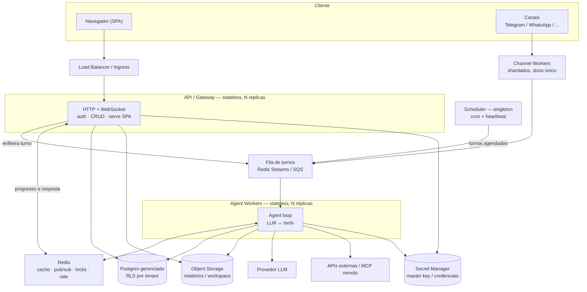
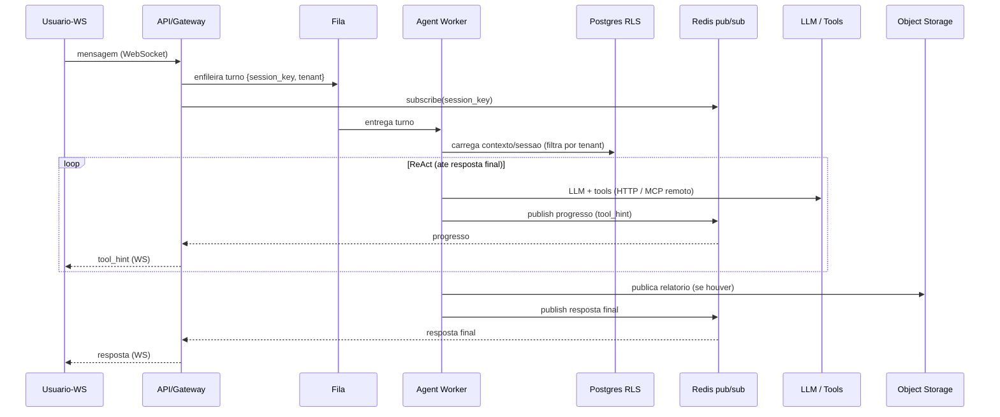
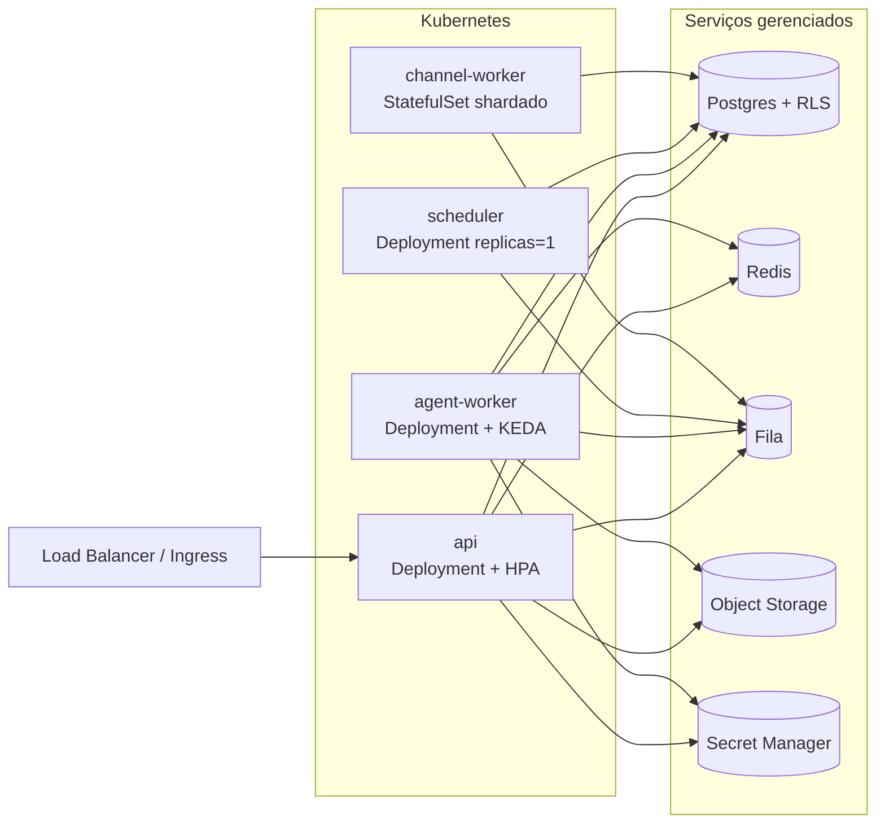

# 07 — Cloud, multi-tenant e escalabilidade (arquitetura de deploy)

> **Status:** proposto, não iniciado.
> **Tipo:** arquitetura de infraestrutura (faseado).
> **Decisões:** caminho **portável cloud-native** (workers stateless) + isolamento **lógico/RLS**.
> **Relaciona-se com:** [05](05-padronizacao-capacidades.md) (capacidades) e
> [06](06-capacidades-do-cliente.md) (MCP remoto tira os subprocessos stdio do caminho).

## 1. Contexto e objetivo

Hoje a aplicação roda como **um container / um processo** (uvicorn único) com **SQLite em arquivo
local** e muito **estado em memória**. Precisa ir pro cloud suportando **muitos clientes e muitos
usuários simultâneos**, com **isolamento entre tenants** e **escala horizontal** (N réplicas atrás
de load balancer). Objetivo do doc: o alvo de arquitetura e o caminho incremental pra chegar lá,
sem big-bang e reusando o que já está abstraído.

## 2. Avaliação: "sandbox do core por usuário" vs. o que o mercado usa

A ideia de **isolar o core do agente por usuário e matar ao fim do fluxo** tem a intuição certa
(isolamento + blast-radius + ciclo de vida limpo), mas o **mecanismo** de sandbox/pod/VM por
usuário é o padrão para **execução de código não-confiável** (E2B/Firecracker/gVisor/Modal) — e
código de cliente ficou **fora de escopo** (decisão do 06: só HTTP + MCP remoto). O workload real
do core é **I/O-bound** (LLM + chamadas HTTP/MCP); pod-por-usuário custa caro (cold start,
scheduling, reserva de recurso) e é complexo (conexão de DB, secrets, rede por pod) para resolver
uma ameaça que não existe ainda.

O que o mercado consolidou (2026):

- **Escala** = **workers stateless** + **fila** + **store distribuído** (Redis/DB gerenciado). Agentes
  não guardam estado no processo; qualquer worker roda qualquer turno.
- **Isolamento multi-tenant** = **lógico/namespace** (infra compartilhada, dados separados) —
  Postgres **RLS**, credenciais/egress/quotas por tenant. VM-por-tenant só em tier enterprise.
- **Sandbox microVM** = reservado para **código não-confiável** — adotar só quando/se o 06 ganhar
  tool de código, e aí sandboxar **só a execução do código**, não o core inteiro.
- **Fronteira (alternativa estratégica futura):** **modelo de atores / Cloudflare Durable Objects**
  — um agente addressable por usuário-sessão, estado próprio, WebSocket nativo, hiberna a custo
  zero e acorda sob demanda. É a versão elegante da ideia original, mas é aposta de plataforma
  (portar o runtime). Fica registrada como caminho B; **este doc segue o caminho A (portável).**

## 3. Bloqueadores atuais (o que assume 1 processo/host)

Resumo do audit (refs no código):

- **Dados**: conexão **aiosqlite única compartilhada** (`db/sqlite/connection.py`), PRAGMAs/WAL/
  backup de arquivo local; SQL específico de SQLite nos repos (**FTS5** em `rag_repo.py`/
  `memory_repo`/`client_memory_repo`/`migrations.py`, `json_extract`, `AUTOINCREMENT`/`lastrowid`).
  **Bom:** repos são 17 Protocols com um único ponto de troca (`db/factory.py` → `create_*_factory`);
  nenhum SQL de SQLite vaza pros callers.
- **Estado em memória** (quebra com N réplicas): `AgentLoop._user_contexts`, `_user_mcp_cache`,
  `_consolidation_locks`/`_consolidating` (risco de **arquivamento duplicado** de memória),
  `ClientAwareAgentLoop._client_swap_locks`, `RateLimiter._recent` (limite vira **N×**),
  `ChannelManager.user_channels`, `ws_clients`/`ws_tasks`.
- **WebSocket**: entrega **in-process** (`_deliver` só vê sockets da própria réplica) e turno rodado
  **inline** no worker web (`process_direct`) — se o socket reconecta em outra réplica, a resposta é
  **perdida** silenciosamente.
- **Disco local**: relatórios escritos e servidos do disco (`report_page.py`/`azure_report.py` +
  rota `/r/{token}`) → 404 em outra réplica; `master.key` **auto-gerado por pod** (`utils/crypto.py`)
  → credenciais viram indecifráveis entre réplicas; workspace/data-dir; cron `jobs.json`; skills/
  memory FS mode.
- **Subprocessos por tenant**: MCP **stdio/npx** (`mcp.py`/`mcp_launcher.py`), **Chromium+Xvfb+VNC**
  compartilhado, `exec` shell — tudo dentro do container do app.
- **Singletons que rodam duplicado** em N réplicas (`cli/commands.py` `asyncio.gather`): **cron**
  (dispara cada job N×), **heartbeat**, **agent-loop consumer** sobre **bus em memória**
  (`bus/queue.py`), **channel dispatcher/restore** (conecta os mesmos tokens N×). Sem leader
  election / lock distribuído.
- **Config/secrets**: `config.json` em disco local; `master.key` por arquivo (fallback). `env_prefix
  NANOBOT_` já existe (parcialmente 12-factor).

## 4. Arquitetura-alvo (caminho A — portável)

Quebrar o monolito em deployables, todos stateless exceto o scheduler:

- **API/Gateway (stateless, N réplicas)**: HTTP + WebSocket, auth, CRUD (agents/skills/tools/
  integrações), serve o SPA. **Não roda o turno inline** — enfileira o turno e faz streaming do
  progresso/resultado via **Redis pub/sub** por `session_key`. Autoscale por conexões/CPU.
- **Agent Workers (stateless, N réplicas)** = "o core do agente" separado: consomem turnos da
  **fila**, rodam o loop (LLM ↔ tools), publicam progresso + resposta final no pub/sub. Autoscale
  por profundidade da fila (KEDA). Worker é fungível; não há afinidade por usuário.
- **Scheduler (singleton / leader)**: cron + heartbeat em **replicas=1** (ou leader-election) →
  elimina o disparo duplicado.
- **Channel workers**: donos das conexões de canal por tenant (WhatsApp/Telegram), **cada canal
  pertencente a exatamente um worker** (sharding), não a todas as réplicas.

Serviços gerenciados (backing):

- **Postgres** (gerenciado): substitui SQLite via `create_postgres_factory` (mesmo `RepositoryFactory`).
  **RLS** para isolamento (§5). **tsvector**/`to_tsquery` (ou **pgvector**) substitui FTS5;
  `SERIAL/IDENTITY` no lugar de `AUTOINCREMENT`; `jsonb ->>` no lugar de `json_extract`.
- **Redis**: cache de `UserContext`/sessão (com TTL; invalidação via pub/sub entre réplicas —
  resolve a config stale), **pub/sub** de entrega WS, **rate limiter distribuído**, **locks
  distribuídos** (consolidação de memória), e possivelmente a **fila** (Redis Streams).
- **Fila/broker**: Redis Streams / SQS / Redpanda — desacopla API↔workers, dá retry/backpressure/
  autoscale. Substitui o `bus/queue.py` em memória.
- **Object storage (S3/compatível)**: relatórios e workspace (substitui disco local); `/r/{token}`
  passa a redirecionar/stream de URL assinada.
- **Secret manager / master key via env** (KMS/Vault): fim do `master.key` auto-gerado por pod;
  chave única compartilhada.

Mapa bloqueador → correção: SQLite→Postgres/RLS · estado em memória→Redis · WS in-process→pub/sub ·
disco→S3 · master.key→secret manager · singletons→scheduler leader + broker + canais shardados ·
subprocessos→MCP remoto (06) / isolar-ou-desligar browser·desktop·exec no cloud.

## 4a. Arquitetura visual (diagramas)

> **Ver no VS Code:** o preview nativo de Markdown não renderiza Mermaid. Instale a extensão
> **Markdown Preview Mermaid Support** (`bierner.markdown-mermaid`) e abra o preview com
> `Ctrl/Cmd + Shift + V`. No GitHub renderiza automático.

### 4a.1 Componentes do sistema

### 4a.2 Quebra de serviços (deployables)

| Serviço | Responsabilidade | Estado | Escala | Depende de | NÃO faz |
|---|---|---|---|---|---|
| **api** | HTTP + WebSocket, auth, CRUD (agents/skills/tools/integrações), serve SPA, enfileira turnos, faz streaming da resposta via pub/sub | Stateless | HPA (conexões/CPU), N réplicas | Postgres, Redis, Fila, S3, Secret mgr | Não roda o loop do agente inline |
| **agent-worker** | Consome turnos da fila, roda o loop (LLM ↔ tools), publica progresso/resposta no pub/sub | Stateless | KEDA (profundidade da fila), N réplicas | Fila, Redis, Postgres, S3, LLM, APIs/MCP | Não termina WebSocket; não agenda |
| **scheduler** | Cron + heartbeat: enfileira turnos agendados | Singleton | `replicas=1` (ou leader-election) | Fila, Postgres | Não processa turno (só enfileira) |
| **channel-worker** | Conexões de canal por tenant (Telegram/WhatsApp); cada canal com dono único | Stateful (conexões) | Shardado por canal/tenant | Fila, Postgres | Não é replicado sem sharding |
| **Postgres** (gerenciado) | Verdade dos dados, isolados por **RLS**; busca via tsvector/pgvector | — | Gerenciado (réplicas de leitura) | — | — |
| **Redis** (gerenciado) | Cache de contexto (TTL + invalidação), **pub/sub** de entrega, locks distribuídos, rate limiter | — | Gerenciado/cluster | — | — |
| **Fila** | Desacopla api↔workers; retry/backpressure | — | Gerenciado | — | — |
| **Object Storage** | Relatórios/workspace; `/r/{token}` por URL assinada | — | Gerenciado | — | — |
| **Secret Manager** | Master key + credenciais (fim do `master.key` por pod) | — | Gerenciado | — | — |

### 4a.3 Fluxo de um turno de chat (sequência)

Ponto-chave: como a entrega é por **pub/sub keyed por `session_key`**, se o WebSocket do usuário
reconectar em **outra réplica de api**, ela também está inscrita no canal e entrega a resposta —
sem sticky-session e sem perder o resultado (o bug atual do §3).

### 4a.4 Topologia de deploy

## 5. Isolamento (lógico / RLS)

- **Modelo**: tabelas compartilhadas + coluna `tenant_id` (= `user_id`/org) + **políticas RLS** no
  Postgres — toda query é filtrada pelo banco por `current_setting('app.tenant')`, setado por
  request/worker a partir do token autenticado. Elimina a classe de bug "esqueci o WHERE user_id".
- **Defesa em profundidade**: credenciais por tenant já encriptadas (Fernet→KMS); **egress/SSRF**
  guard (06) por tenant; **quotas** de rate/tokens/timeout/tamanho por tenant (o rate limiter vira
  distribuído no Redis); auditoria por tenant.
- **Tier enterprise (futuro)**: schema-por-tenant ou db-por-tenant + namespace/rede dedicados —
  opção premium, não o default.

## 6. Faseamento (incremental, cada fase entregável e testável)

1. **F1 — Postgres + RLS (fundamento)**: `create_postgres_factory` (mesmo contrato dos Protocols);
   portar SQL SQLite-only (FTS5→tsvector/pgvector, `json_extract`, ids); políticas RLS + `tenant_id`;
   migração de dados SQLite→PG. Sem mudar topologia ainda (1 réplica), mas já em Postgres.
2. **F2 — Externalizar estado**: Redis para cache (com invalidação via pub/sub), locks de
   consolidação, rate limiter; **entrega WS via pub/sub** por `session_key`; relatórios em **S3**
   (+ `/r/{token}` por URL assinada); **master key via secret manager**. Resultado: **2+ réplicas
   de API** já corretas atrás de LB.
3. **F3 — Agent workers via fila**: API para de rodar o turno inline → **enfileira**; **worker pool
   stateless** consome e publica resultado no pub/sub; autoscale (KEDA) por profundidade da fila.
   **Scheduler/heartbeat como singleton**; **canais shardados** (dono único).
4. **F4 — Runtime pesado**: MCP **remoto-only** no cloud (flag desliga stdio/npx); `browser`/
   `computer`/`screenshot`/`exec` **isolados em serviço à parte ou desligados** no cloud (quando
   voltarem como código de cliente, via sandbox do 06).
5. **F5 — Hardening & observabilidade**: quotas por tenant, egress via proxy, tracing/métricas
   (OpenTelemetry), HPA/health/readiness, backups/DR do Postgres.

## 7. Verificação

- **F1**: subir contra Postgres; suíte `pytest` verde com o factory de PG; RLS **bloqueia** leitura
  cross-tenant (teste: sessão do tenant A não enxerga linhas de B); busca RAG/histórico funciona no
  novo backend.
- **F2**: **2 réplicas** atrás de nginx/traefik → mandar turno numa, reconectar WebSocket na outra
  e **receber a resposta**; alterar provider/skill numa réplica reflete na outra (invalidação via
  pub/sub); abrir `/r/{token}` de qualquer réplica (S3); reiniciar réplica não perde a chave.
- **F3**: matar um worker no meio do turno → outro assume da fila; **cron dispara 1×** com N
  workers; autoscale sobe worker sob carga.
- **F4/F5**: no cloud, nenhum subprocesso stdio/desktop no pod do app; quotas por tenant cortam
  abuso; dashboards de latência/erro por tenant.

## 8. Riscos / decisões em aberto

- **Migração de dados** SQLite→Postgres (one-shot com verificação); FTS5→tsvector muda ranking (validar RAG).
- **Fila**: Redis Streams (menos infra) vs SQS/Kafka (mais garantias) — decidir na F3 pelo volume.
- **WS**: pub/sub (recomendado) vs sticky-session — pub/sub evita afinidade e sobrevive a reconexão.
- **Actor model (caminho B)** fica como alternativa estratégica se a densidade "1 agente por
  usuário barato-quando-ocioso" virar requisito — reavaliar pós-F3.
- **Sandbox de código** só entra junto com tool de código do cliente (02), isolando a execução, não
  o core.

## 9. Fontes

- AI agent platform architecture / stateless workers + queues (2026) — <https://www.knowlee.ai/blog/ai-agent-platform-architecture-2026> · <https://designgurus.substack.com/p/designing-ai-agents-at-scale-queues>
- Multi-tenant AI agent isolation (namespace/logical) — <https://fast.io/resources/ai-agent-multi-tenant-architecture/> · <https://engineering.salesforce.com/building-a-multi-tenant-ai-agent-platform-handling-7k-sessions-without-cross-team-interference/>
- Ephemeral sandboxes p/ código (E2B/Firecracker/gVisor/Modal) — <https://amux.io/guides/ai-agent-sandboxing/> · <https://northflank.com/blog/e2b-vs-modal-vs-fly-io-sprites>
- Actor model / Cloudflare Durable Objects & Agents — <https://developers.cloudflare.com/agents/> · <https://developers.cloudflare.com/durable-objects/concepts/what-are-durable-objects/>
- Postgres multi-tenant (RLS vs schema vs db) — <https://www.thenile.dev/blog/multi-tenant-rls> · <https://aws.amazon.com/blogs/database/multi-tenant-data-isolation-with-postgresql-row-level-security/>
